# Object Detection in an Urban Environment

## Project Overview

For this project, we will be using data from the [Waymo Open dataset](https://waymo.com/open/).

Explain the project

## project Setup

## Data Set

### Data Exploratory Analysis 

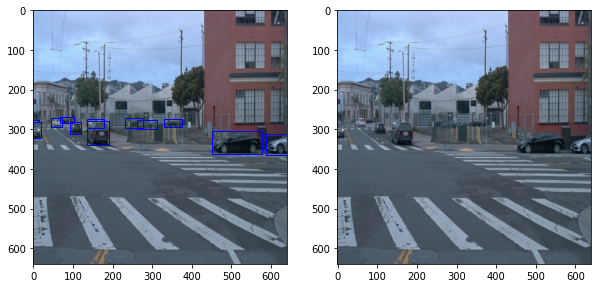
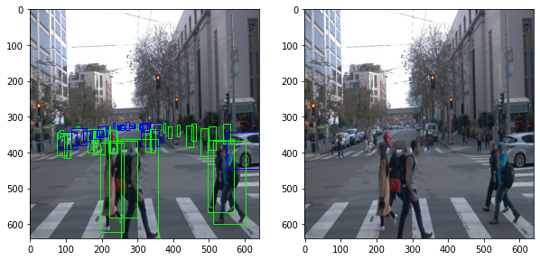
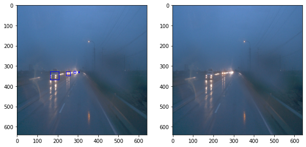
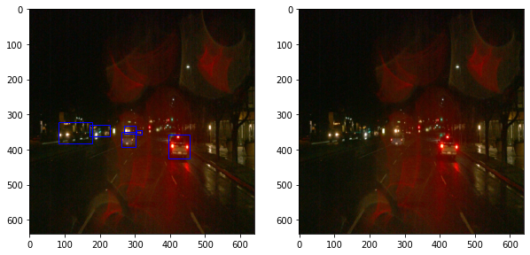
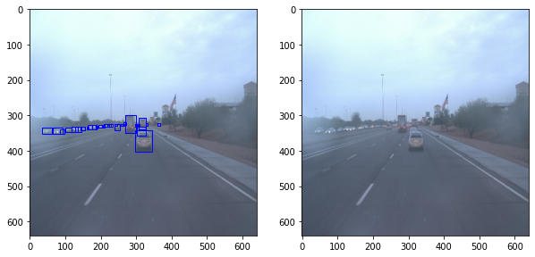
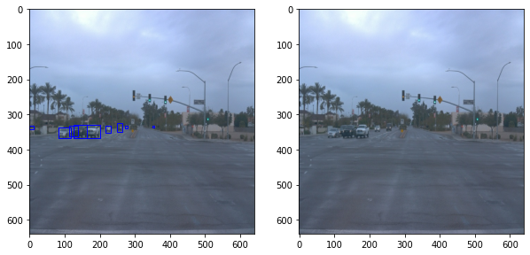
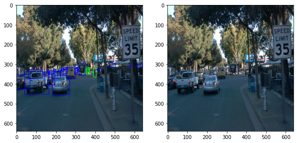
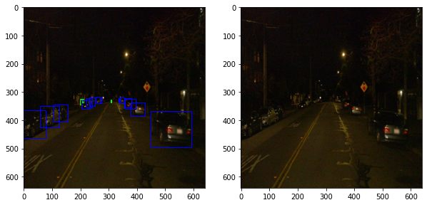
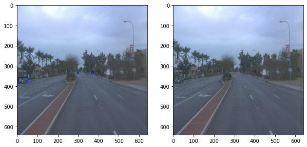
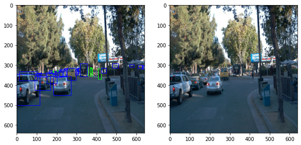

### Data Augmentation Analysis

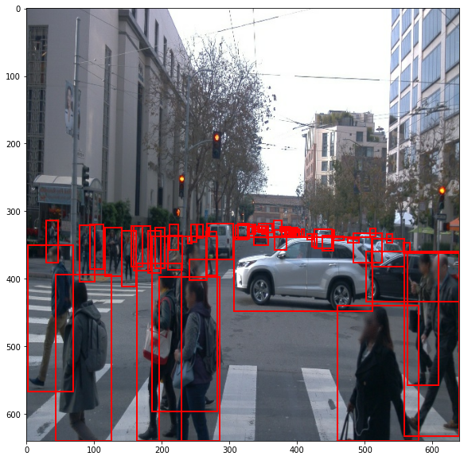 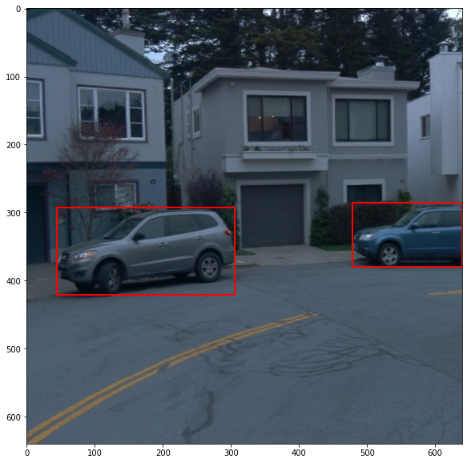
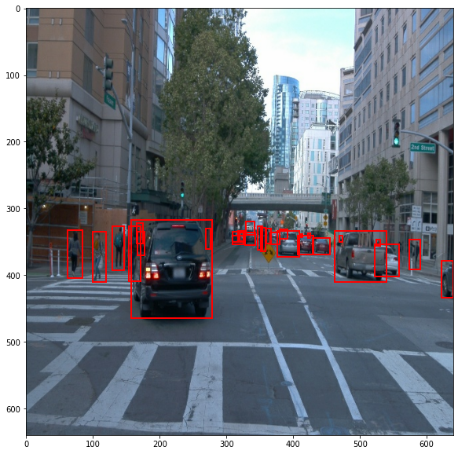 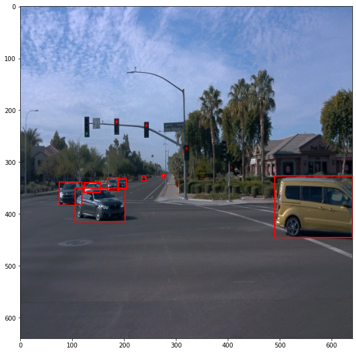

## Training

### Training Experiment

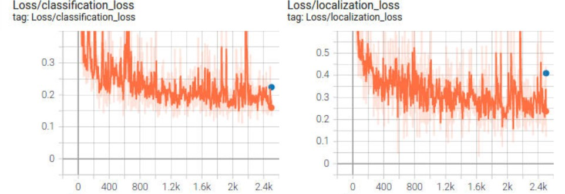
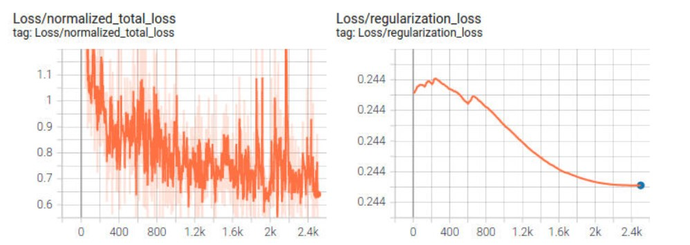
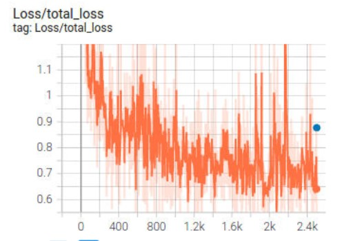

### Improve the reference

How I run it to improve performace
