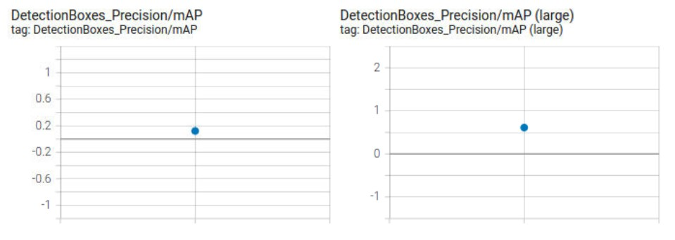
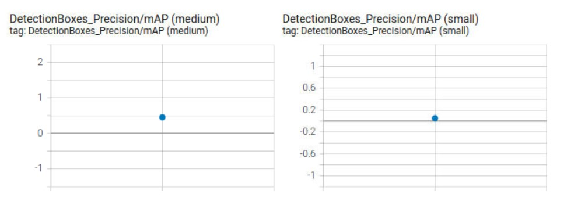
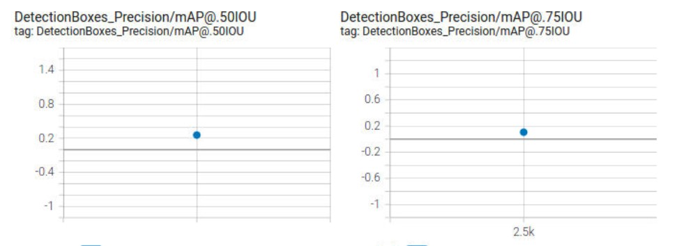
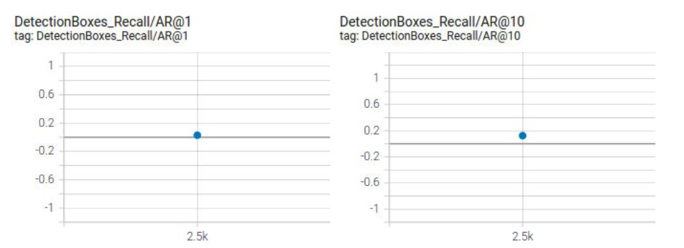
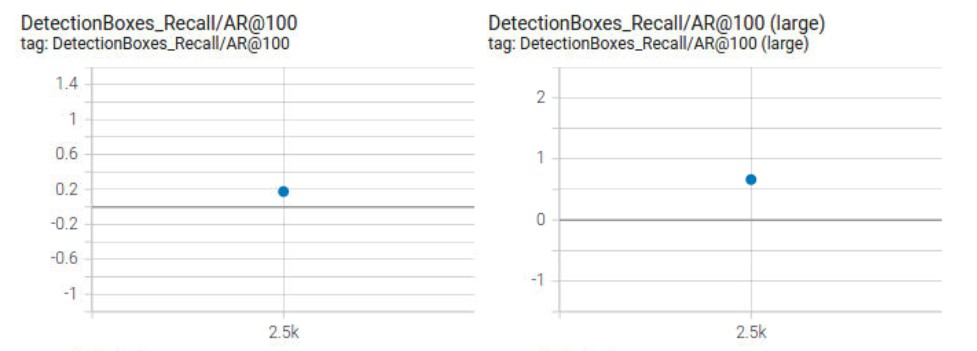
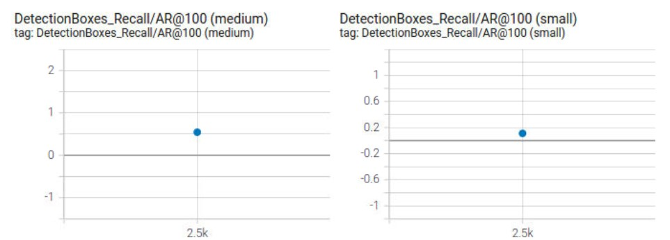

# Object Detection in an Urban Environment

## Project Overview

This is SSD (Single Shot Detector) model training project. The goal is to classify objects of cars, pedestrians and 
cyclists as a classfication problem and to determine the location of these objects or their bounding boxs in the images
as a regression problem. 

For this project, we will be using data from the [Waymo Open dataset](https://waymo.com/open/) and a pretrained model 
which is the ssd_resnet50_v1_fpn_640x640_coco17_tpu-8.tar.gz. We shall use Tensor flow object detetction API to custimize
the training of the model. The Tensor Object Detection API relies on a config file to custimize the model training.

## project Setup

For this project I used the Udacity Desktop ennviroment fot training and evaluation. The structure of 
the data is as follow:

### Data Structure 
The structure of the data used for training, validation and testing is organized as follow:
```
/home/workspace/data/waymo
    - training_and_validation - contains 97 files to train and validate your models
    - train: contain the train data (empty to start)
    - val: contain the val data (empty to start)
    - test - contains 3 files to test your model and create inference videos
```
### Experiments Folder

This is the default experiments folder structure provided by Udacity:
```
experiments/
    - pretrained_model/
    - exporter_main_v2.py - to create an inference model
    - model_main_tf2.py - to launch training
    - reference/ - reference training with the unchanged config file
    - experiment0/ - create a new folder for each experiment you run
    - label_map.pbtxt
    ...
```
I created a Final_Config_File folder in GitHub that include the final version of the pipeline_new.config
file that I used to train and evaluate the final model.

```
Final_Config_File/
    - pretrained_model/pipeline_new.config

```


## Data Set

### Data Exploratory Analysis 

I used the Exploratory Data Analysis.ipynb to plot ten random figures with cars bounding boxes in blue and
pedesrians bounding boxes in green and cyclists bounding boxes in yellow. The cars were the most extremly 
frequent objects followed by pedestrians. Cyclists were very rare. As the images below shows that the data 
included images with different brightness, and intensity levels. Also the plots included images of objects 
at different, depth, scale, and with occulsions. More data analysis of the frequency of objects and there 
distribution over the image dataset could have been very usefull and interesting if time on the GPU permitted.


### Data Augmentation Analysis

The execution of the Explore augmentations.ipynb notebook showed two images inside of the notebook. I modified the noteboo 
and the config file to plot four augmented images. These images from the left to the right is "Horizantol Flip", "Crop Image", 
"Adjust Brightness", and "Adjust Contrast". Something that would have been very usefull is the ability to plot the original 
image next to its augmented image to visualize the effect that is made on the images.

 
 

## Training

### Training Experiment


 










### Improve the reference

How I run it to improve performace
